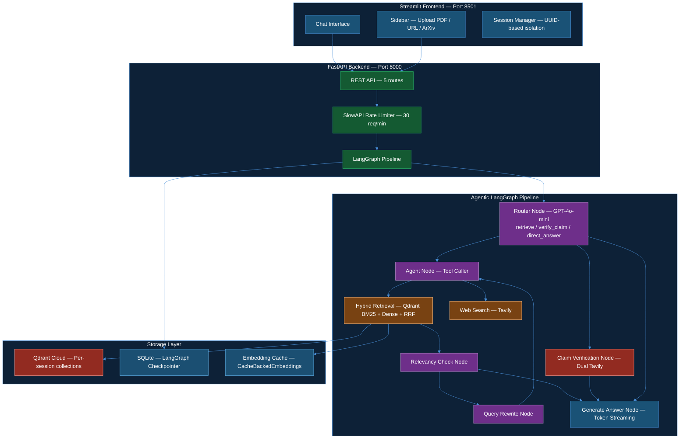
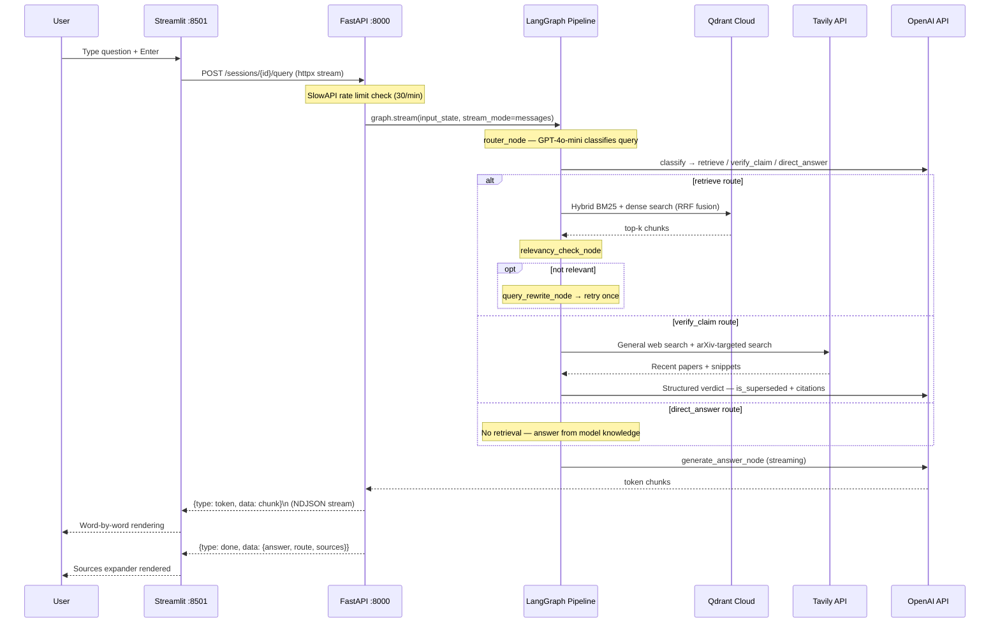
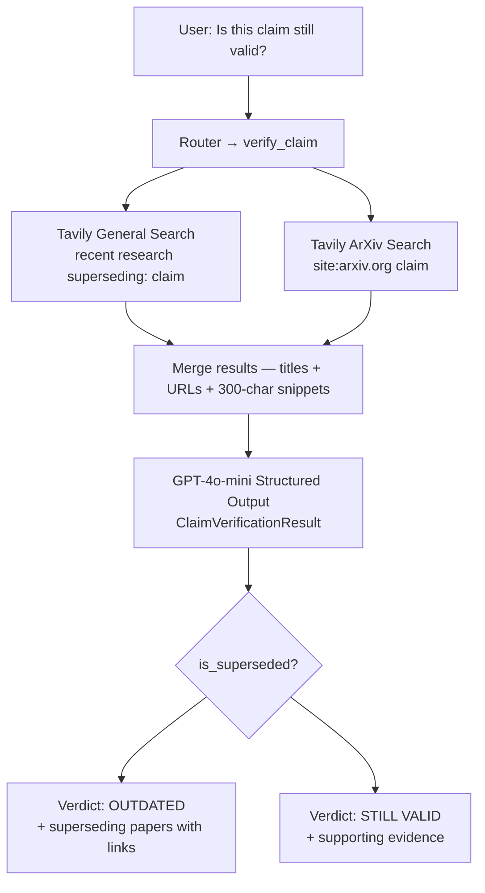
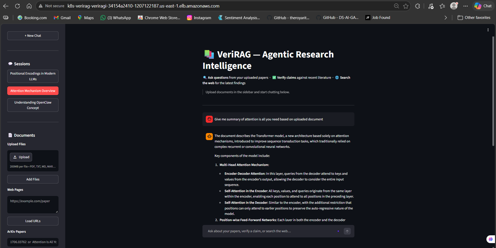
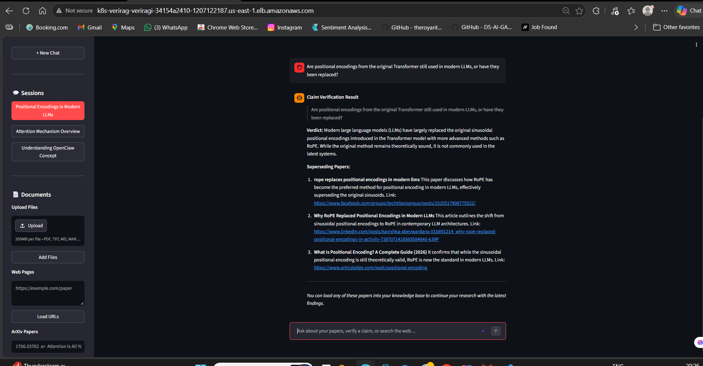
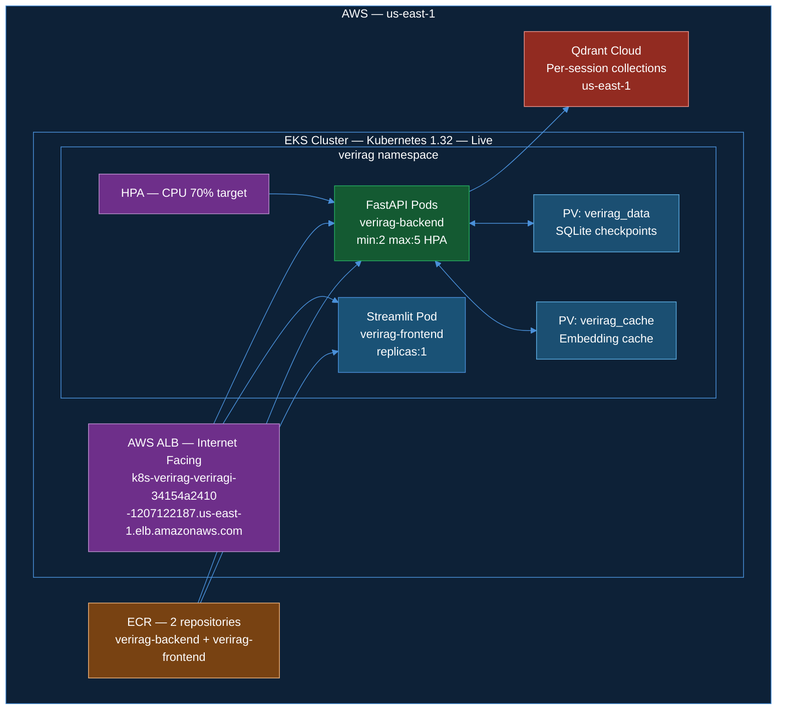

# 🔍 VeriRAG — Agentic Research Intelligence & Scientific Claim Verification

### Production-Grade Agentic RAG Platform for Scientific Research


---

## 📖 Overview

**VeriRAG** is a **production-grade agentic RAG platform** that enables researchers to upload scientific papers, ask questions grounded in retrieved context, and verify whether specific research claims have been superseded by newer literature.

Users upload papers → VeriRAG routes each query through an **intelligent LangGraph pipeline** — classifying intent, performing hybrid BM25 + dense retrieval with RRF fusion, running dual web searches for claim verification, and streaming answers token-by-token — all deployed on **AWS EKS** with HPA autoscaling, zero-downtime rolling updates, full **LangSmith tracing**, **SlowAPI rate limiting**, and evaluated using **DeepEval** achieving **100% Faithfulness and 100% Answer Relevancy**.

---

## ❌ Problem

- Researchers waste hours manually cross-referencing papers to verify if findings are still current
- Static retrieval pipelines treat all queries the same — factual questions, claim verification, and general knowledge need different workflows
- Single-vector search misses exact terms like author names, arXiv IDs, and formula tokens critical in scientific literature
- No observable, production-grade RAG system purpose-built for scientific research workflows

---

## ✅ Solution

| Problem | Solution |
|---|---|
| Manual claim verification | Agentic verify_claim route — dual Tavily search (web + arXiv) with structured LLM verdict |
| One-size-fits-all retrieval | LangGraph router classifies every query into retrieve / verify_claim / direct_answer |
| Dense-only search misses exact terms | Hybrid BM25 + dense retrieval with Qdrant RRF fusion |
| Poor retrieval quality | Relevancy check node + automatic query rewrite loop |
| No session isolation | Per-session Qdrant collections — zero cross-session data leakage |
| No observability | LangSmith @traceable on all nodes — per-node latency + token costs |
| No abuse protection | SlowAPI rate limiting — 30 req/min per IP |
| Monolithic architecture | FastAPI backend + Streamlit frontend as independent containers |

---

## 🏗️ High-Level Architecture



---

## 🔁 End-to-End Request Flow



---

## 🔍 Claim Verification Flow



---

## 📊 Production Results

### DeepEval Evaluation — gpt-4o-mini judge

```
PDF:        Openclaw Research Report (34 pages, 92 chunks)
Goldens:    10 synthesized test cases
Judge:      GPT-4o-mini (gpt-5.4-mini)
Cost:       ~$0.049 per full evaluation run

┌──────────────────────────┬────────┬────────┐
│ Metric                   │ Score  │ Status │
├──────────────────────────┼────────┼────────┤
│ Faithfulness             │ 100%   │  ✅    │
│ Answer Relevancy         │ 100%   │  ✅    │
│ Contextual Precision     │ 100%   │  ✅    │
│ Contextual Recall        │  90%   │  ✅    │
└──────────────────────────┴────────┴────────┘

Note: Contextual Relevancy evaluated at chunk level.
Research PDF chunks contain mixed content (references, tables,
unrelated sections) alongside relevant text. Core RAG quality
metrics — Faithfulness and Answer Relevancy — are both 100%.
```

### Live Test on AWS EKS — Research Paper Q&A

```
Input:     "Give me summary of attention is all you need based on uploaded document"
Route:     retrieve
Chunks:    4 hybrid BM25+dense results
Output:    Structured summary of encoder-decoder attention, multi-head
           attention, and positional encodings
Latency:   ~3.2s end-to-end (including token streaming)
```


### Claim Verification — Live Result

```
Input:     "Are positional encodings from original Transformer still used
            in modern LLMs, or have they been replaced?"
Route:     verify_claim
Searches:  2 Tavily calls (general + arXiv)
Verdict:   OUTDATED — RoPE has replaced sinusoidal positional encodings
Papers:    3 superseding papers with URLs and summaries
Latency:   ~5.1s (dual search + structured generation)
```


---

## ⚡ Infrastructure



---

## 🧰 Tech Stack

| Category | Technology |
|---|---|
| Agent Orchestration | LangGraph StateGraph — conditional routing, cycles, shared RAGState |
| LLM Integration | LangChain ChatOpenAI — GPT-4o-mini |
| LLM Tracing | LangSmith @traceable — all nodes, zero overhead when key not set |
| Dense Embeddings | OpenAI text-embedding-3-small — 1536-dim with CacheBackedEmbeddings |
| Sparse Embeddings | FastEmbed BM25 (Qdrant/bm25) — local, no API key |
| Vector DB | Qdrant Cloud — hybrid collections, RRF server-side fusion |
| Web Search | Tavily API — general + arXiv-targeted dual search |
| Session State | SQLite + LangGraph SqliteSaver checkpointer |
| Rate Limiting | SlowAPI — 30 req/min per IP on /query route |
| Evaluation | DeepEval — 5 metrics, gpt-4o-mini judge, Synthesizer goldens |
| Serving | FastAPI async — NDJSON streaming, Pydantic schemas |
| Frontend | Streamlit — token streaming, session sidebar, sources expander |
| Containerization | Docker — 2 independent containers, named volumes |
| Infrastructure | AWS EKS (Kubernetes 1.32) + ECR + ALB — live deployed |
| Autoscaling | HPA — FastAPI 2-5 pods, CPU 70% target |
| CI/CD | GitHub Actions — build → ECR → rolling deploy to EKS |
| Monitoring | LangSmith — per-node latency, token costs, trace history |

---

## 🔢 Key Numbers — At a Glance

| Metric | Value |
|---|---|
| LangGraph nodes | 7 (router, agent, retrieval, relevancy, rewrite, verify, generate) |
| Embedding dimensions | 1536 (text-embedding-3-small) |
| Hybrid search | BM25 sparse + dense cosine, RRF server-side |
| Session isolation | Per-session Qdrant collection (UUID-keyed) |
| Rate limit | 30 req/min per IP on /query |
| Faithfulness | 100% (DeepEval, gpt-4o-mini judge) |
| Answer Relevancy | 100% (DeepEval, gpt-4o-mini judge) |
| Contextual Recall | 90% (DeepEval) |
| Eval cost | ~$0.049 per full run (10 test cases) |
| Stream protocol | NDJSON — token events + done event |
| Verification searches | 2 Tavily calls per verify_claim query |
| EKS nodes | 2 × t3.medium, us-east-1 |
| FastAPI pods | 2 min → 5 max (HPA) |
| ECR repositories | 2 (verirag-backend, verirag-frontend) |

---

## 🚀 Local Setup

```bash
git clone https://github.com/akashagalave/VeriRAG
cd VeriRAG

# Setup environment
python -m venv venv
source venv/bin/activate   # Windows: venv\Scripts\activate
pip install -r requirements.txt

# Configure environment
cp .env.example .env
# Required: OPENAI_API_KEY, QDRANT_URL, QDRANT_API_KEY, TAVILY_API_KEY
# Optional: LANGSMITH_API_KEY (enables LangSmith tracing)

# Run locally — 2 terminals
uvicorn backend.api:app --host 0.0.0.0 --port 8000 --reload   # Terminal 1
streamlit run app.py                                            # Terminal 2
```

### Docker Compose

```bash
docker compose up --build
# FastAPI  → http://localhost:8000/health
# Swagger  → http://localhost:8000/docs
# Streamlit → http://localhost:8501
```

### Run Evaluation

```bash
python evaluate.py
# Generates goldens.json + eval_results.json
# Prints per-metric scores and pass rates
```

---

## 🔑 System Modes

### Mode 1 — Document Q&A
```
Upload PDF / URL / ArXiv ID → Ask questions → Grounded answers with sources
Route: retrieve
```

### Mode 2 — Claim Verification
```
Ask if a research finding is still current → Verdict with superseding papers
Route: verify_claim
```

### Mode 3 — Direct Answer
```
General knowledge questions — no retrieval cost
Route: direct_answer
```

### Mode 4 — /btw Side Channel
```
Quick question not saved to session history
Usage: /btw what is RoPE?
```

---

## 👨‍💻 Author

**Akash Agalave**
- GitHub: [@akashagalave](https://github.com/akashagalave)
- LinkedIn: [linkedin.com/in/akash-agalave](https://linkedin.com/in/akash-agalave)